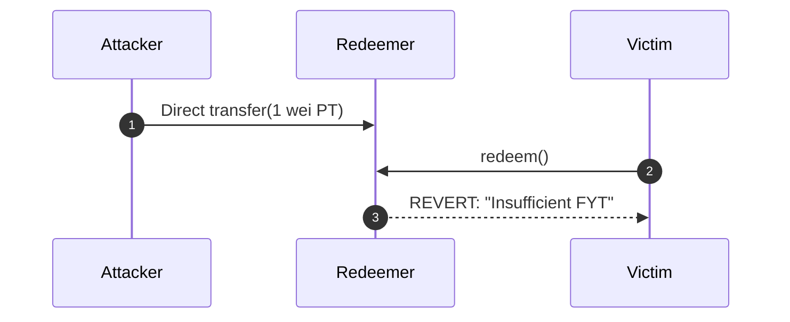

# Analysis: Illuminate PT Redemption DoS

**Severity:** High
**Finding ID:** H-01

## Summary
The `Redeemer` contract is susceptible to a permanent Denial of Service (DoS) attack via direct token donation. The vulnerability stems from a strict equality check against `balanceOf(address(this))`.

## Technical Details
The redemption logic assumes that the Principal Token (PT) balance in the contract is always backed by an equivalent amount of Future Yield Tokens (FYT). 

By transferring as little as **1 wei** of PT directly to the `Redeemer` contract, an attacker inflates the PT balance. This breaks the following invariant:

$$\text{fyt.balanceOf}(address(this)) \ge \text{pt.balanceOf}(address(this))$$

When a user attempts to call `redeem()`, the contract fails the balance check and reverts, permanently locking all redemptions.

## Attack Flow


## Proof of Concept
Replicate the state failure using Foundry:
```bash
forge test --match-contract IlluminateAPWineDoSPoC -vvvv
```

## Mitigation
Use **Internal Accounting**. Track token balances through a dedicated state variable instead of relying on the raw `balanceOf` value, which is an external and manipulatable state.