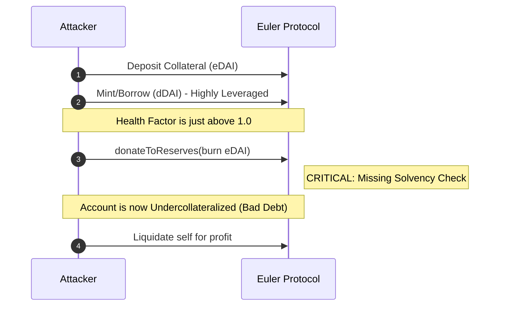

# Analysis: Euler Finance 'donateToReserves' Logic Flaw

**Severity:** Critical
**Finding ID:** H-01
**Date:** March 2023

## Summary
Euler Finance suffered a $200M+ exploit due to a missing health check in the `donateToReserves` function. This allowed users to voluntarily reduce their collateral (eTokens) while maintaining their debt (dTokens), resulting in an undercollateralized position that bypassed standard liquidation protections.

## Technical Details
In lending protocols, any state-changing operation that reduces an account's health factor must be guarded by a solvency check. In Euler's implementation, the `donateToReserves` function lacked the `checkLiquidation` modifier.

An attacker could:
1. Deposit a small amount of collateral.
2. Leverage the position by minting a massive amount of eTokens and dTokens (increasing both assets and liabilities).
3. Call `donateToReserves` to burn their eTokens.

Because the health check was missing, the account was allowed to enter a deeply insolvent state without being immediately blocked. This created an artificial bad debt scenario that the attacker exploited via a self-liquidation, draining the protocol's reserves.

## Attack Flow


## Proof of Concept
This PoC simulates the voluntary burning of collateral to break the health factor:
```bash
forge test --match-contract Exploit_2023_03_EulerFinance -vvvv
```

## Mitigation
**Enforce Solvency Invariants.** Every function that reduces the collateral-to-debt ratio must verify the account's health factor before finalizing the state transition. Utility functions like `donate` are not exempt from core protocol safety checks.