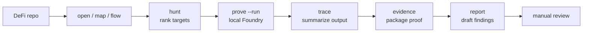

# Arkheionx

<p align="center">
  <strong>Foundry-style local security workbench for DeFi protocol research.</strong>
</p>

<p align="center">
  <strong>Find the money. Map the protocol. Prove the path.</strong>
</p>

<p align="center">
  <code>Stable: v2.6.0</code> ·
  <code>Python 3.11+</code> ·
  <code>Local-first</code> ·
  <code>No RPC by default</code> ·
  <code>Foundry-aware</code>
</p>

Arkheionx turns a DeFi codebase into a focused local research workflow:

- a protocol map
- a money-flow graph
- a ranked hunter plan
- a local Foundry proof workflow
- trace summaries
- evidence packages
- responsible report drafts

Foundry proves. Arkheionx maps, ranks, guides, summarizes, validates, and
packages the evidence.



## Why Arkheionx

Foundry tells you whether tests pass. Arkheionx helps you decide what to test
first, then packages the result for human review.

- Map where value enters, exits, and is controlled.
- Rank high-signal review targets.
- Run targeted local proof workflows.
- Turn proof/trace output into evidence and report drafts.

## 60-Second Quickstart

```sh
python3 -m pip install -e .

arkheionx doctor
arkheionx open .
arkheionx hunt . --top 5
arkheionx prove . --target Contract.function --run
arkheionx trace . --target Contract.function
arkheionx evidence . --target Contract.function
arkheionx report . --target Contract.function
```

If proof artifacts do not exist yet, Arkheionx prints the next command instead
of crashing.

## Command Set

| Command              | Purpose                                            |
| -------------------- | -------------------------------------------------- |
| `doctor`             | Check install, Foundry, and project layout         |
| `open`               | One-command project orientation                    |
| `map`                | Show protocol roles, journeys, and money flow      |
| `flow`               | Build the money-flow graph                         |
| `hunt`               | Rank bug-hunting surfaces                          |
| `prove`              | Generate or run a targeted local Foundry proof     |
| `trace`              | Summarize proof/trace output                       |
| `evidence`           | Package proof and trace artifacts                  |
| `report`             | Create a responsible local report draft            |
| `evidence-status`    | Show which artifacts exist per target              |
| `validate-artifacts` | Validate generated proof/evidence/report artifacts |

Legacy and advanced commands (`scan`, `validate-config`, `test-plan`,
`search`) remain supported for specialized workflows.

## Evidence Model

Arkheionx keeps evidence levels explicit so a local finding is not overstated.

- `HEURISTIC` - static analysis and pattern matching only.
- `COMPILER_CONFIRMED` - the target compiles in the local project.
- `EXECUTION_CONFIRMED` - a relevant local Foundry test executed.
- `EVIDENCE_READY` - proof and trace artifacts are packaged for review.

A passing test does not prove absence of bugs. A failing test does not
automatically prove a vulnerability. Human review is required.

## Example Terminal Output

```text
ARKHEIONX HUNT
Project: .
Status: warning
Mode: heuristic
Foundry: not-a-foundry-project

Top targets
  1. Vault.withdraw       92 high    asset exit + share accounting
  2. Rewards.claim        84 high    reward claim + token out
  3. Oracle.setPrice      78 medium  pricing control

Next
  arkheionx prove . --target Vault.withdraw --run
```

## Safety Boundaries

- Local repository analysis only.
- No RPC by default.
- No live-chain mutation.
- No private keys or secrets.
- No automated exploitation.
- No auto-submit.
- Not an audit, certification, or replacement for manual review.
- No severity guarantee.
- Use only on repositories you own or are authorized to review.

## Install / Requirements

- Python 3.11+.
- Foundry is optional but recommended for compiler and execution confirmation.
- Local install is the supported path. No PyPI package is published.

```sh
sh install.sh                # safe local installer (pipx or venv, no sudo)
sh arkup --check             # inspect/update an existing install (MVP)
python3 -m pip install -e .  # or a plain editable install
arkheionx doctor
```

See [`docs/INSTALLER.md`](docs/INSTALLER.md) and [`docs/ARKUP.md`](docs/ARKUP.md)
for options and the install/update lifecycle, and
[`docs/UNINSTALL.md`](docs/UNINSTALL.md) to remove it.

## Documentation

Start:

- [`docs/INSTALLATION.md`](docs/INSTALLATION.md)
- [`docs/CLI_REFERENCE.md`](docs/CLI_REFERENCE.md)
- [`docs/SOLO_RESEARCH_WORKFLOW.md`](docs/SOLO_RESEARCH_WORKFLOW.md)

Core workflow:

- [`docs/PROTOCOL_MAP.md`](docs/PROTOCOL_MAP.md)
- [`docs/VALUE_FLOW_WORKBENCH.md`](docs/VALUE_FLOW_WORKBENCH.md)
- [`docs/EXECUTION_PROOF.md`](docs/EXECUTION_PROOF.md)
- [`docs/TRACE_ENGINE.md`](docs/TRACE_ENGINE.md)
- [`docs/EVIDENCE_PACKAGE.md`](docs/EVIDENCE_PACKAGE.md)
- [`docs/REPORT_DRAFTS.md`](docs/REPORT_DRAFTS.md)
- [`docs/EVIDENCE_WORKFLOW_HARDENING.md`](docs/EVIDENCE_WORKFLOW_HARDENING.md)
- [`docs/ARTIFACT_VALIDATION.md`](docs/ARTIFACT_VALIDATION.md)

Advanced:

- [`docs/GITHUB_ACTION_USAGE.md`](docs/GITHUB_ACTION_USAGE.md)
- [`docs/SARIF_OUTPUT.md`](docs/SARIF_OUTPUT.md)
- [`docs/SEARCH_KNOWLEDGE.md`](docs/SEARCH_KNOWLEDGE.md)
- [`docs/ROADMAP.md`](docs/ROADMAP.md)

## Current Release

Latest stable release: **v2.6.0 — arkup & Version-Manager MVP**.

Current stable workflow:

```text
doctor -> open -> map -> flow -> hunt -> prove --run -> trace -> evidence -> report -> manual review
```

Next milestone: **v2.7.0**.

## GitHub Action

Minimal static pre-audit workflow:

```yaml
- uses: actions/checkout@v4
- uses: Yudis-bit/DeFi-Exploit-PoCs/.github/actions/pre-audit@v2.6.0
  with:
    protocol-type: "auto"
```

See [`docs/GITHUB_ACTION_USAGE.md`](docs/GITHUB_ACTION_USAGE.md) for options.

## Research Archive

Arkheionx began as a defensive DeFi exploit-reproduction archive. The archive
remains available as background research material:

- [`docs/VULNERABILITY_REGISTRY.md`](docs/VULNERABILITY_REGISTRY.md)
- [`reports/research_dashboard.md`](reports/research_dashboard.md)

## Maintainer

Built by Yudistira Putra / [@Yudis-bit](https://github.com/Yudis-bit).
Arkheionx prioritizes local-first analysis, honest evidence levels, safe
workflows, and human review.

## License / Disclaimer

Defensive research and authorized review only. Not security, legal, or
investment advice.
