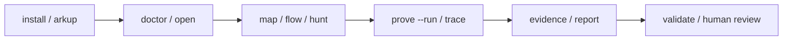

# Arkheionx

<p align="center">
  <strong>Foundry-style local security workbench for DeFi protocol research.</strong>
</p>

<p align="center">
  <strong>Find the money. Map the protocol. Prove the path.</strong>
</p>

<p align="center">
  <code>Stable: v2.10.0</code> ·
  <code>Python 3.11+</code> ·
  <code>Local-first</code> ·
  <code>No RPC by default</code> ·
  <code>Foundry-aware</code>
</p>

<p align="center">
  
</p>

Arkheionx turns a DeFi codebase into a focused local research workflow: a
protocol map, a money-flow graph, a ranked hunter plan, a local Foundry proof
workflow, and trace summaries, evidence packages, and responsible report drafts.

Foundry proves. Arkheionx maps, ranks, guides, summarizes, validates, and
packages the evidence — locally, with no RPC and no secrets.

Arkheionx v3.0.0 is the public stable launch: one coherent, documented local
workflow with a stable command surface, honest evidence levels, and a safe
install/update lifecycle. v3.0.0 is in preparation; the latest published release
is v2.10.0.

## Architecture

<p align="center">
  
</p>

The CLI and install lifecycle sit on top. Bundled demo fixtures and package data
feed a local pipeline: protocol map, value flow, and hunt ranking, then optional
Foundry proof and trace, then evidence and report drafts, then artifact
validation. Human review is the final, required step.

## Who it is for

Solo auditors, protocol engineers, and security researchers who want to
organize what to review in a DeFi repository they own or are authorized to
review — before reaching for heavier tooling.

## Why Arkheionx

Foundry tells you whether tests pass. Arkheionx helps you decide what to test
first, then packages the result for human review. Protocol structure and value
flow are usually scattered across files; review notes and proof artifacts end
up ad hoc. Arkheionx gives that work a repeatable local shape.

- Map where value enters, exits, and is controlled.
- Rank high-signal review targets instead of guessing.
- Run targeted local proof workflows.
- Turn proof/trace output into evidence and report drafts with honest evidence
  levels.

## Core Workflow



## 60-Second Quickstart

Install (local-first, no sudo, no PyPI):

```sh
sh install.sh
arkheionx version
arkheionx doctor
```

Copy a bundled demo and explore it (local-only, no RPC):

```sh
arkheionx demo --list
arkheionx demo --copy amm-swap ./arkheionx-demo
arkheionx open ./arkheionx-demo
arkheionx hunt ./arkheionx-demo --top 5
```

With Foundry available, run the proof/evidence path:

```sh
arkheionx prove ./arkheionx-demo --target AMMSwapFixture.swapAForB --run
arkheionx trace ./arkheionx-demo --target AMMSwapFixture.swapAForB
arkheionx evidence ./arkheionx-demo --target AMMSwapFixture.swapAForB
arkheionx report ./arkheionx-demo --target AMMSwapFixture.swapAForB
arkheionx validate-artifacts ./arkheionx-demo
```

If proof artifacts do not exist yet, Arkheionx prints the next command instead
of crashing. See [`docs/DEMO_WORKFLOW.md`](docs/DEMO_WORKFLOW.md) for the full
guided run.

## Demo Fixtures

<p align="center">
  
</p>

Three small, local-only toy fixtures ship as package data (so `demo --copy`
works from an installed Arkheionx, not only a source checkout):

| Demo | Surface | Recommended target |
| --- | --- | --- |
| `oracle-staking` | staking / reward / oracle | `OracleRewardFixture.stake` |
| `amm-swap` | swap / reserves / liquidity | `AMMSwapFixture.swapAForB` |
| `lending-vault` | collateral / debt / liquidation | `LendingVaultFixture.borrow` |

They are demonstrations, not real protocols or vulnerability reports. See
[`docs/PACKAGE_DATA.md`](docs/PACKAGE_DATA.md).

## Command Set

<p align="center">
  
</p>

| Command | Purpose |
| --- | --- |
| `demo` | List and copy a safe local demo workflow |
| `doctor` | Check install, Foundry, and project layout |
| `open` | One-command project orientation |
| `map` | Show protocol roles, journeys, and money flow |
| `flow` | Build the money-flow graph |
| `hunt` | Rank bug-hunting surfaces |
| `prove` | Generate or run a targeted local Foundry proof |
| `trace` | Summarize proof/trace output |
| `evidence` | Package proof and trace artifacts |
| `report` | Create a responsible local report draft |
| `evidence-status` | Show which artifacts exist per target |
| `validate-artifacts` | Validate generated proof/evidence/report artifacts |

Install lifecycle: `sh install.sh`, `sh arkup --check`, `sh uninstall.sh`.
Legacy/advanced commands (`scan`, `validate-config`, `test-plan`, `search`)
remain supported for specialized workflows. Full reference:
[`docs/CLI_REFERENCE.md`](docs/CLI_REFERENCE.md).

## Outputs

<p align="center">
  
</p>

Every run writes deterministic local artifacts under `.arkheionx/out/`
(gitignored): protocol understanding and a money-flow graph (JSON + Mermaid), a
ranked hunter plan, Foundry proof scaffolds and execution summaries, compact
trace summaries, structured evidence packages, and responsible report drafts
labelled for human review.

## Evidence Model

Arkheionx keeps evidence levels explicit so a local finding is not overstated.

<p align="center">
  
</p>

- `HEURISTIC` - static analysis and pattern matching only.
- `COMPILER_CONFIRMED` - the target compiles in the local project.
- `EXECUTION_CONFIRMED` - a relevant local Foundry test executed.
- `EVIDENCE_READY` - proof and trace artifacts are packaged for review.

A passing test does not prove absence of bugs. A failing test does not
automatically prove a vulnerability. Human review is required.

## What's Stable in v3.0.0

<p align="center">
  
</p>

v3.0.0 commits to a clear public contract:

- Public command names are stable; no removal or rename without a compatibility
  bridge and documentation.
- JSON output and schemas change additively where possible, and stay plain.
- Human-readable terminal output may be polished over time — do not parse it.
- Safety boundaries are fixed and never weakened.

Not guaranteed: vulnerability discovery, severity, bounty eligibility, or that a
heuristic finding is a real bug. Internal Python modules are not a public API.
See [`docs/STABILITY_CONTRACT.md`](docs/STABILITY_CONTRACT.md) and
[`docs/V3_READINESS.md`](docs/V3_READINESS.md).

## Terminal Output

Human-facing output uses restrained color (headings, statuses, evidence levels)
when attached to a TTY. Set `NO_COLOR` or `ARKHEIONX_COLOR=never` to disable it,
or `ARKHEIONX_COLOR=always` to force it. JSON output and files written to disk
are always plain.

## Safety Boundaries

- Local repository analysis only.
- No RPC by default.
- No live-chain mutation.
- No private keys or secrets.
- No transaction broadcasting.
- No automated exploitation.
- No auto-submit.
- No guaranteed vulnerability discovery.
- Not an audit, certification, or replacement for manual review.
- No severity guarantee.
- Use only on repositories you own or are authorized to review.

## Install / Requirements

- Python 3.11+.
- Foundry is optional but recommended for compiler and execution confirmation.
- Local install is the supported path. No PyPI package is published.

```sh
sh install.sh                # safe local installer (pipx or venv, no sudo)
sh arkup --check             # inspect/update an existing install (MVP)
python3 -m pip install -e .  # or a plain editable install
arkheionx doctor
```

See [`docs/INSTALLER.md`](docs/INSTALLER.md) and [`docs/ARKUP.md`](docs/ARKUP.md)
for options and the install/update lifecycle, and
[`docs/UNINSTALL.md`](docs/UNINSTALL.md) to remove it.

## Documentation

Start:

- [`docs/INSTALLATION.md`](docs/INSTALLATION.md)
- [`docs/DEMO_WORKFLOW.md`](docs/DEMO_WORKFLOW.md)
- [`docs/CLI_REFERENCE.md`](docs/CLI_REFERENCE.md)
- [`docs/SOLO_RESEARCH_WORKFLOW.md`](docs/SOLO_RESEARCH_WORKFLOW.md)

Core workflow:

- [`docs/PROTOCOL_MAP.md`](docs/PROTOCOL_MAP.md)
- [`docs/VALUE_FLOW_WORKBENCH.md`](docs/VALUE_FLOW_WORKBENCH.md)
- [`docs/EXECUTION_PROOF.md`](docs/EXECUTION_PROOF.md)
- [`docs/TRACE_ENGINE.md`](docs/TRACE_ENGINE.md)
- [`docs/EVIDENCE_PACKAGE.md`](docs/EVIDENCE_PACKAGE.md)
- [`docs/REPORT_DRAFTS.md`](docs/REPORT_DRAFTS.md)

Advanced:

- [`docs/PACKAGE_DATA.md`](docs/PACKAGE_DATA.md) · [`docs/UPDATE_FLOW.md`](docs/UPDATE_FLOW.md)
- [`docs/GITHUB_ACTION_USAGE.md`](docs/GITHUB_ACTION_USAGE.md)
- [`docs/OUTPUT_STANDARD.md`](docs/OUTPUT_STANDARD.md)
- [`docs/ROADMAP.md`](docs/ROADMAP.md)

Stability and v3 readiness:

- [`docs/PUBLIC_SURFACE.md`](docs/PUBLIC_SURFACE.md)
- [`docs/STABILITY_CONTRACT.md`](docs/STABILITY_CONTRACT.md)
- [`docs/V3_READINESS.md`](docs/V3_READINESS.md)

## Current Release

Latest stable release: **v2.10.0 — Pre-v3 Public Readiness & Stability Hardening**.

```text
doctor -> open -> map -> flow -> hunt -> prove --run -> trace -> evidence -> report -> manual review
```

Active development: **v3.0.0 — DeFi Value Flow Workbench** (public-stable
direction, not yet released). See [`docs/ROADMAP.md`](docs/ROADMAP.md) and
[`docs/V3_READINESS.md`](docs/V3_READINESS.md).

## GitHub Action

Minimal static pre-audit workflow:

```yaml
- uses: actions/checkout@v4
- uses: Yudis-bit/DeFi-Exploit-PoCs/.github/actions/pre-audit@v2.10.0
  with:
    protocol-type: "auto"
```

See [`docs/GITHUB_ACTION_USAGE.md`](docs/GITHUB_ACTION_USAGE.md) for options.

## Research Archive

Arkheionx began as a defensive DeFi exploit-reproduction archive, still
available as background research material:

- [`docs/VULNERABILITY_REGISTRY.md`](docs/VULNERABILITY_REGISTRY.md)
- [`reports/research_dashboard.md`](reports/research_dashboard.md)

## Maintainer

Built by Yudistira Putra / [@Yudis-bit](https://github.com/Yudis-bit).
Arkheionx prioritizes local-first analysis, honest evidence levels, safe
workflows, and human review.

## License / Disclaimer

Defensive research and authorized review only. Not security, legal, or
investment advice.
