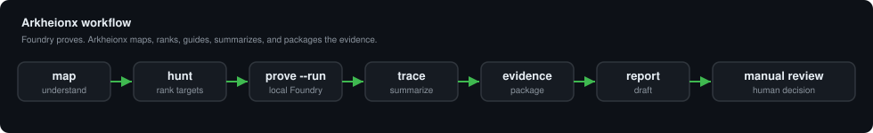

# Arkheionx

A Foundry-style local security workbench for DeFi protocol research.

**Find the money. Map the protocol. Prove the path.**

`Stable: v2.3.0` | `Python: 3.11+` | `Local-first` | `No RPC by default` | `Foundry-aware`

Arkheionx turns a DeFi codebase into a readable protocol map, a money-flow
graph, a ranked bug-hunting plan, a local Foundry proof workflow, and
report-ready evidence — all on your machine.



## Why Arkheionx

Foundry tells you whether your tests pass. Arkheionx helps you decide what to
test first.

- It maps where value enters, is stored, exits, and who controls it.
- It ranks the highest-signal review surfaces for a solo researcher.
- It runs targeted local Foundry proofs and summarizes the trace.
- It packages proof + trace into evidence and a responsible report draft.

Foundry proves. Arkheionx maps, ranks, guides, summarizes, and packages the
evidence. It does not replace Foundry, and it is not a formal audit.

## 60-Second Quickstart

```sh
python3 -m pip install -e .

arkheionx doctor
arkheionx open .
arkheionx hunt . --top 5
arkheionx prove . --target Contract.function --run
arkheionx trace . --target Contract.function
arkheionx evidence . --target Contract.function
arkheionx report . --target Contract.function
```

If no proof exists yet, `evidence` and `report` print the next command to run
instead of crashing.

## What It Does

| Command | Purpose |
|---|---|
| `doctor` | Check install, Foundry, and project layout |
| `open` | One-command project orientation |
| `map` | Show protocol roles, journeys, and money flow |
| `flow` | Build the money-flow graph (Mermaid + JSON) |
| `hunt` | Rank bug-hunting surfaces |
| `prove` | Generate / run a targeted local Foundry proof |
| `trace` | Summarize proof / trace output |
| `evidence` | Package proof + trace artifacts |
| `report` | Create a responsible local report draft |
| `evidence-status` | Show which artifacts exist per target |
| `validate-artifacts` | Validate generated artifacts |

Legacy/advanced commands (`scan`, `validate-config`, `test-plan`, `search`)
remain supported — see [`docs/CLI_REFERENCE.md`](docs/CLI_REFERENCE.md).

## Evidence Model

Every major result carries one honest evidence level:

- `HEURISTIC` — static scan only (useful for direction, not proof).
- `COMPILER_CONFIRMED` — `forge build` confirmed the target compiles.
- `EXECUTION_CONFIRMED` — a relevant local Foundry test actually executed.
- `EVIDENCE_READY` — proof + trace packaged for a report draft.

A passing test does not prove the absence of bugs; a failing test does not by
itself prove a vulnerability. Severity is never final and always needs human
review.

## Example Output

```text
ARKHEIONX HUNT
Project: .
Status: warning
Mode: heuristic
Foundry: not-a-foundry-project

Top targets
  1. Vault.withdraw       92 high    asset exit + share accounting
  2. Rewards.claim        84 high    reward claim + token out
  3. Oracle.setPrice      78 medium  pricing control

Next
  arkheionx prove . --target Vault.withdraw --run
```

Generated artifacts (JSON, Mermaid, proof, trace, evidence, report) are written
under `.arkheionx/out/`. See [`docs/OUTPUT_STANDARD.md`](docs/OUTPUT_STANDARD.md).

## Safety Boundaries

- Local repository analysis only.
- No RPC by default; no live-chain mutation.
- No private keys, mnemonics, or secret handling.
- No exploit automation.
- No auto-submit of reports.
- Not a formal audit; no final severity guarantee.

Use Arkheionx only on repositories you own or are authorized to review. See
[`docs/ETHICS.md`](docs/ETHICS.md) and [`docs/SECURITY.md`](docs/SECURITY.md).

## Install / Requirements

- Python 3.11+.
- Foundry (`forge`) is optional but recommended — it unlocks
  `COMPILER_CONFIRMED` and `EXECUTION_CONFIRMED` evidence. Without it, Arkheionx
  works in heuristic mode.
- Local editable install (no PyPI package is published):

```sh
python3 -m pip install -e .
arkheionx version
arkheionx doctor
```

## Documentation

Start:

- [`docs/INSTALLATION.md`](docs/INSTALLATION.md)
- [`docs/CLI_REFERENCE.md`](docs/CLI_REFERENCE.md)
- [`docs/SOLO_RESEARCH_WORKFLOW.md`](docs/SOLO_RESEARCH_WORKFLOW.md)

Core workflow:

- [`docs/PROTOCOL_MAP.md`](docs/PROTOCOL_MAP.md)
- [`docs/VALUE_FLOW_WORKBENCH.md`](docs/VALUE_FLOW_WORKBENCH.md)
- [`docs/EXECUTION_PROOF.md`](docs/EXECUTION_PROOF.md)
- [`docs/TRACE_ENGINE.md`](docs/TRACE_ENGINE.md)
- [`docs/EVIDENCE_PACKAGE.md`](docs/EVIDENCE_PACKAGE.md)
- [`docs/REPORT_DRAFTS.md`](docs/REPORT_DRAFTS.md)
- [`docs/FOUNDRY_INTEGRATION.md`](docs/FOUNDRY_INTEGRATION.md)

Advanced:

- [`docs/GITHUB_ACTION_USAGE.md`](docs/GITHUB_ACTION_USAGE.md)
- [`docs/SARIF_OUTPUT.md`](docs/SARIF_OUTPUT.md)
- [`docs/SEARCH_KNOWLEDGE.md`](docs/SEARCH_KNOWLEDGE.md)
- [`docs/ROADMAP.md`](docs/ROADMAP.md)
- [`docs/RELEASE_CHECKLIST.md`](docs/RELEASE_CHECKLIST.md)

## Current Release

Latest stable release: **v2.4.0 — Evidence Workflow Hardening**. It hardens the
local research loop: `open → map → flow → hunt → prove --run → trace → evidence
→ report → manual review` with `evidence-status` and `validate-artifacts`.
Next: v2.5.0. See [`docs/ROADMAP.md`](docs/ROADMAP.md) and [`CHANGELOG.md`](CHANGELOG.md).

## GitHub Action

A local/static pre-audit Action is available (no secrets, no RPC). Minimal use:

```yaml
- uses: actions/checkout@v4
- uses: Yudis-bit/DeFi-Exploit-PoCs/.github/actions/pre-audit@v2.4.0
  with:
    protocol-type: "auto"
```

Full options and SARIF upload: [`docs/GITHUB_ACTION_USAGE.md`](docs/GITHUB_ACTION_USAGE.md)
and [`docs/SARIF_OUTPUT.md`](docs/SARIF_OUTPUT.md).

## Research Archive

Arkheionx began as a defensive DeFi exploit-reproduction archive. That corpus
(historical, patched incidents) still backs the workbench's pattern knowledge:

- Vulnerability registry: [`docs/VULNERABILITY_REGISTRY.md`](docs/VULNERABILITY_REGISTRY.md)
- Research status snapshot: [`reports/research_dashboard.md`](reports/research_dashboard.md)

## Maintainer

Built by Yudistira Putra ([@Yudis-bit](https://github.com/Yudis-bit)).
Arkheionx prioritizes local-first analysis, honest evidence levels, safe
workflows, and human review over hype.

## License / Disclaimer

For defensive research and authorized review only. Reproductions target
historical, patched, or resolved incidents. Nothing here is security, legal, or
investment advice, and the maintainer assumes no liability for downstream use.
