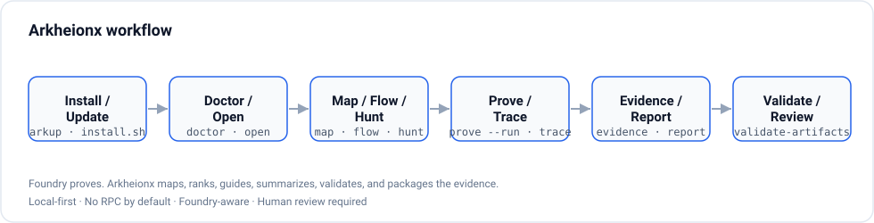
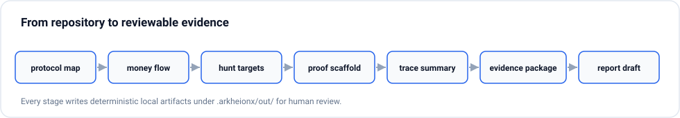
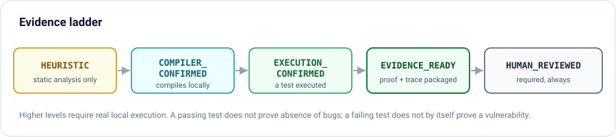
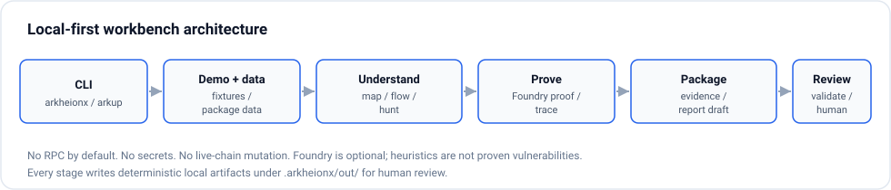
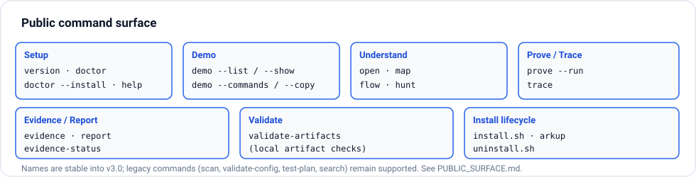
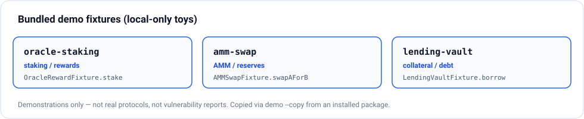
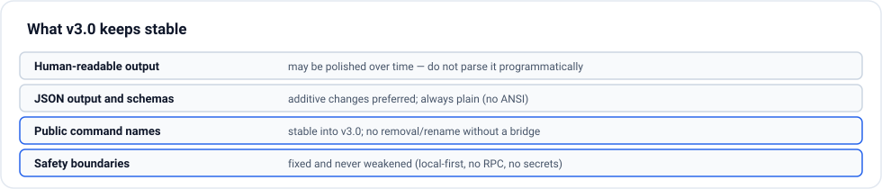

# ArkheionX

<!-- Compatibility alias for existing public-surface tests: # Arkheionx -->

**A local review map for DeFi smart-contract repos.**

> **Foundry tells you whether the tests you wrote pass. ArkheionX helps show
> the value paths you may have forgotten to test.**

ArkheionX turns a local Solidity / Foundry repository into a deterministic
**review map**: where value enters, moves, and exits; the trust assumptions that
guard each path; which paths have no tests; and a ranked list of what a human
reviewer should inspect first.

```bash
python3 -m pip install -e .
arkheionx doctor
arkheionx review-map .                                        # your repo
arkheionx review-map examples/vault-strategy-oracle-fixture   # bundled demo
```

```text
OK    Map review surface  3 contracts, 14 functions, 3 value paths, 5 test gaps

Inspect first
1  HIGH   Strategy.divest            Signals  external-call, value-out
2  HIGH   Vault.emergencyWithdraw    Signals  external-call, privileged, value-out
3  HIGH   Vault.withdraw             Signals  external-call, value-out

Test gap   Vault.withdraw   Source  src/Vault.sol:63   Proof  proof-vault-withdraw
```

Local only. Static only. No RPC. No live-chain calls. No exploit automation.
Not an audit replacement. New here? See
[`docs/TRY_IN_5_MINUTES.md`](docs/TRY_IN_5_MINUTES.md) and the bundled
[multi-contract demo](examples/vault-strategy-oracle-fixture/README.md).

## Core workflow

ArkheionX supports one workflow end to end:

```text
repo → review-map → value paths → assumptions → test gaps → proof direction → human review
```

Everything below serves that workflow. A human always makes the security call.

## Why ArkheionX exists

Reviewing a DeFi protocol is not just checking whether the tests you wrote pass.
A reviewer needs to know where value enters, moves, and exits, which assumptions
protect each path, and which value paths have no tests at all. That context is
usually rebuilt by hand, inconsistently, every time. ArkheionX makes the review
surface explicit and repeatable **before** manual review, so you spend review
time where value moves.

## What is ArkheionX?

ArkheionX helps security researchers and protocol engineers create a repeatable
local review surface for DeFi repositories. It maps protocol structure, roles,
value paths, assumptions, test gaps, evidence context, and benchmarked fixture
output.

Foundry tells you which tests passed. ArkheionX helps organize what a human
reviewer should inspect next: money-flow graph, review-map output, Test Gap Map,
assumptions, evidence links, and local validation artifacts.

The v3.1 line introduced the Developer-Native Review Map and Local Artifact Foundation.
v3.9.0 adds the public-safe fixture benchmark harness, deterministic artifact
fingerprints, and snapshot drift checks.
The full v4 Protocol Security Control Plane remains planned direction,
not a completed v3.2.0 runtime surface.

## What Arkheionx Does

- Maps contracts, functions, value paths, assumptions, and test gaps.
- Surfaces a ranked "inspect first" list (review order, not severity).
- Shows source evidence (`Source: <file>:<line>`) for each test gap where available.
- Suggests local proof directions you can scaffold with Foundry.
- Builds local review packages under `.arkheionx/out/`.
- Provides a fixture benchmark harness for static/local fixtures.
- Supports deterministic fixture source fingerprints and snapshot drift checks.
- Produces human-review-oriented evidence context.

## What It Does Not Do

- Does not confirm vulnerabilities automatically.
- Does not replace auditors.
- Does not prove protocol safety.
- Does not assign final severity.
- Does not submit reports or bounties.
- Does not run live-chain operations by default.
- Does not require RPC, private keys, seed phrases, or secrets.
- Does not automate exploits.

## V4 stable scope

**Arkheionx v4.0.0 stabilizes the local review-map workflow.** It does not mean
Arkheionx guarantees protocol safety.

Stable commands (work on any install): `arkheionx version`, `arkheionx doctor`,
`arkheionx review-map`, `arkheionx value-paths`, `arkheionx assumptions`,
`arkheionx test-gap-map`, `arkheionx proof-plan`.

Experimental / advanced (source-tree only): `scan`, `test-plan`, and `search`
delegate to repository helpers and are not the canonical first run. Deeper
cross-contract tracing is limited, and real-protocol case studies are pending.

Full detail: [`docs/V4_STABLE_SCOPE.md`](docs/V4_STABLE_SCOPE.md).

## Why local-first?

Security review tooling should be inspectable and reproducible. ArkheionX keeps
the default workflow on local repository files so review artifacts can be
regenerated, diffed, and checked without hidden services or network state.

Default operation is intentionally narrow:

- Local repository analysis only.
- No RPC by default.
- No live-chain mutation.
- No private keys or secrets.
- No automated exploitation.
- No auto-submit.
- Not an audit, certification, or replacement for manual review.
- No guaranteed vulnerability discovery.
- No severity guarantee.

Human review is required. ArkheionX provides review context, not final security
judgments.

## Quick Start

```bash
python3 -m venv .venv
source .venv/bin/activate
python3 -m pip install -e .
arkheionx version
arkheionx doctor
arkheionx review-map .
```

The source-mode equivalent of any command is
`python3 -m arkheionx.cli.main <command>`. The local install helper is also
available:

```bash
sh install.sh
```

For installer details, see [`docs/INSTALLER.md`](docs/INSTALLER.md). No API key,
private key, RPC URL, or token is required.

## Try the V4 demo

```bash
arkheionx review-map examples/vault-strategy-oracle-fixture
```

The bundled fixture is a small multi-contract protocol — `Vault`, `Strategy`,
`PriceOracle`, and `MockToken`. Its test covers `deposit`, and deliberately
leaves the value exits (`withdraw`, `emergencyWithdraw`, `divest`) and the admin
setters (`setOracle`, `setPrice`) untested. ArkheionX surfaces those as value
paths and test gaps. The output is real engine output, not hardcoded, and is
locked by tests so it cannot silently degrade.

## Quick Start Commands

Stable review workflow (start here):

- `doctor` / `arkheionx doctor`
- `review-map` / `arkheionx review-map`
- `value-paths` / `arkheionx value-paths`
- `assumptions` / `arkheionx assumptions`
- `test-gap-map` / `arkheionx test-gap-map`
- `proof-plan` / `arkheionx proof-plan`

Additional workbench commands:

- `open` / `arkheionx open`
- `map` / `arkheionx map`
- `flow` / `arkheionx flow`
- `hunt` / `arkheionx hunt`
- `prove` / `arkheionx prove`
- `trace` / `arkheionx trace`
- `evidence` / `arkheionx evidence`
- `report` / `arkheionx report`
- `validate-artifacts` / `arkheionx validate-artifacts`
- `local-validate` / `arkheionx local-validate`
- `demo` / `arkheionx demo`

Generated outputs are written under `.arkheionx/out/`; they are generated, local, gitignored, and not intended to be committed as source truth.

## Bug bounty and pre-audit usage

ArkheionX is a triage and preparation aid, used by a human:

- **Bug bounty triage** — find where value moves, which paths are untested, and
  what to review first; turn test gaps into manual hypotheses. See
  [`docs/BUG_BOUNTY_WORKFLOW.md`](docs/BUG_BOUNTY_WORKFLOW.md).
- **Pre-audit readiness** — map value paths, write missing tests, and hand a
  reviewer a clearer surface. See
  [`docs/PRE_AUDIT_WORKFLOW.md`](docs/PRE_AUDIT_WORKFLOW.md).

Do not submit ArkheionX output as a vulnerability by itself, validate manually,
and only run it on repositories you are authorized to review.

## Validation

```bash
python3 scripts/check_docs_links.py --check
python3 scripts/check_safety_wording.py --strict
python3 scripts/check_version_consistency.py --check
python3 scripts/check_release_readiness.py --check
python3 -m unittest discover -s tests -p "test_*.py"
make validate
```

## Fixture Benchmark Harness

The fixture harness covers 9 local/static fixtures and produces deterministic
benchmark output for public validation. It records source fingerprints, checks
snapshot drift, and does not perform network calls, RPC calls, or Foundry
execution in benchmark logic.

The harness is for repeatable review context. It does not prove safety.

## Evidence Model

ArkheionX distinguishes local review signals from human conclusions. Artifact
states such as `HUMAN_REVIEWED` are manual reviewer attestation only.
Machine-generated context can help prioritize inspection; it does not decide
impact, exploitability, or severity. Even a relevant local Foundry test executed
is still review context, not a final security judgment.

## Architecture

The current public surface is v3.x local tooling plus fixture benchmarks. The
v3.0.0 is the public stable launch baseline; v4.0.0 is the current technical
state for this branch.















## What's Stable in v3.0.0

The v3 public baseline stabilized the installable CLI, the local review-map
workflow, demo fixtures, safety boundaries, and documentation contracts. v3.9.0
keeps those contracts while adding deterministic fixture benchmarks and source
fingerprints, and v4.0.0 makes the review-map workflow the stable public surface.

## Safety Boundaries

Human review is required. ArkheionX provides review context, not final security
judgments.

Do not use ArkheionX on repositories you are not authorized to review. Do not
use generated artifacts as standalone proof of exploitability, safety, or
impact. Do not add private keys, seed phrases, RPC credentials, or production
targets to local configs.

## GitHub Action

Pinned stable action example:

```yaml
uses: Yudis-bit/DeFi-Exploit-PoCs/.github/actions/pre-audit@v3.1.0
```

See [`docs/GITHUB_ACTION_USAGE.md`](docs/GITHUB_ACTION_USAGE.md).

## Documentation

Full index: [`docs/README.md`](docs/README.md).

Start:

- [`docs/START_HERE.md`](docs/START_HERE.md)
- [`docs/TRY_IN_5_MINUTES.md`](docs/TRY_IN_5_MINUTES.md)
- [`docs/INTERPRET_RESULTS.md`](docs/INTERPRET_RESULTS.md)
- [`docs/WHAT_ARKHEIONX_IS_NOT.md`](docs/WHAT_ARKHEIONX_IS_NOT.md)
- [`docs/BUG_BOUNTY_WORKFLOW.md`](docs/BUG_BOUNTY_WORKFLOW.md)
- [`docs/PRE_AUDIT_WORKFLOW.md`](docs/PRE_AUDIT_WORKFLOW.md)
- [`docs/PUBLIC_ALPHA_READINESS.md`](docs/PUBLIC_ALPHA_READINESS.md)
- [`docs/INSTALLATION.md`](docs/INSTALLATION.md)

Core workflow:

- [`docs/CLI_REFERENCE.md`](docs/CLI_REFERENCE.md)
- [`docs/V4_STABLE_SCOPE.md`](docs/V4_STABLE_SCOPE.md)
- [`docs/PUBLIC_SURFACE.md`](docs/PUBLIC_SURFACE.md)
- [`docs/STABILITY_CONTRACT.md`](docs/STABILITY_CONTRACT.md)
- [`docs/V3_READINESS.md`](docs/V3_READINESS.md)
- [`docs/VALUE_FLOW_WORKBENCH.md`](docs/VALUE_FLOW_WORKBENCH.md)
- [`docs/PROTOCOL_MAP.md`](docs/PROTOCOL_MAP.md)
- [`docs/SOLO_RESEARCH_WORKFLOW.md`](docs/SOLO_RESEARCH_WORKFLOW.md)
- [`docs/TRACE_ENGINE.md`](docs/TRACE_ENGINE.md)
- [`docs/EVIDENCE_PACKAGE.md`](docs/EVIDENCE_PACKAGE.md)
- [`docs/LOCAL_VALIDATION.md`](docs/LOCAL_VALIDATION.md)

Advanced:

- [`docs/FIXTURE_HARNESS.md`](docs/FIXTURE_HARNESS.md)
- [`docs/FIXTURE_BENCHMARKS.md`](docs/FIXTURE_BENCHMARKS.md)
- [`docs/FIXTURE_SNAPSHOT_WORKFLOW.md`](docs/FIXTURE_SNAPSHOT_WORKFLOW.md)
- [`docs/REVIEW_MAP.md`](docs/REVIEW_MAP.md)
- [`docs/REVIEW_PACKAGE.md`](docs/REVIEW_PACKAGE.md)
- [`docs/ARTIFACT_VALIDATION.md`](docs/ARTIFACT_VALIDATION.md)
- [`docs/DEMO_WORKFLOW.md`](docs/DEMO_WORKFLOW.md)
- [`reports/research_dashboard.md`](reports/research_dashboard.md)

## Contributing and feedback

Issues and feedback use the templates under
[`.github/ISSUE_TEMPLATE`](.github/ISSUE_TEMPLATE) (general feedback and a
review-map noise/quality report). See [`CONTRIBUTING.md`](CONTRIBUTING.md) and
the security policy in [`SECURITY.md`](SECURITY.md).

## License

ArkheionX is licensed under the Apache License 2.0. See [`LICENSE`](LICENSE).
The earlier license-pending note is kept at
[`LICENSE_PENDING.md`](LICENSE_PENDING.md) for historical context only.

## Version and release status

**Python 3.11+** · **Local-first** · **No RPC by default** ·
**Human review required** · **v4.0.0 release candidate**

Latest stable release: **v3.1.0**. Current package version: **4.0.0** — the
v4.0.0 release candidate, prepared locally and pending founder push/tag/GitHub
release/site deploy. The last tagged stable release remains **v3.1.0**, which the
source installers and the GitHub Action pin to until the v4.0.0 tag is cut. Next
milestone: **v4.1.0**.

Positioning: Local-first protocol security control plane for DeFi teams.
Map the protocol. Prove the path. Prepare the handoff.
v4.0.0 stabilizes the local review-map workflow; the broader control plane
remains planned direction.

This public-safe branch contains the engine, tests, public technical docs, and
safety workflow. v4.0.0 is not tagged. The public release branch is sanitized.

Official website: [https://arkheionx.dev](https://arkheionx.dev) *(deployment pending)*.
The website source installer should be used only after the deployment
verification documented in [`docs/WEBSITE_DEPLOYMENT.md`](docs/WEBSITE_DEPLOYMENT.md).

Reproducible research context: [`reports/research_dashboard.md`](reports/research_dashboard.md).

## Security

See [`SECURITY.md`](SECURITY.md).
